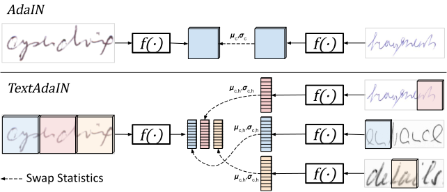
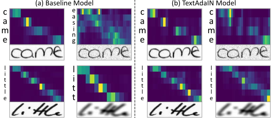

## TextAdaIN: Paying Attention to Shortcut Learning in Text Recognizers
This is the official pytorch implementation of [TextAdaIN](https://arxiv.org/abs/2105.03906) (ECCV 2022).

**[Oren Nuriel](https://scholar.google.com/citations?hl=en&user=x3j-9RwAAAAJ),
[Sharon Fogel](https://scholar.google.com/citations?hl=en&user=fJHpwNkAAAAJ),
[Ron Litman](https://scholar.google.com/citations?hl=en&user=69GY5dEAAAAJ)**

TextAdaIN creates local distortions in the feature map which prevent the network from overfitting to local statistics.  It does so by viewing each feature map as a sequence of elements and deliberately mismatching fine-grained feature statistics between elements in a mini-batch.





## Overcoming the shortcut
Below we see the attention maps of a text recognizer before and after applying local corruptions to the input image.
Each example shows the input image (bottom), attention map (top) and model prediction (left). Each line in the attention map is a time step representing the attention per character prediction. (a) The baseline model, which uses local statistics as a shortcut, misinterprets the corrupted images. (b) Our proposed  method which overcomes this shortcut, enhances performance on both standard and challenging testing conditions



## Integrating into your favorite text recognizer backbone 
Sample code for the class can be found in [TextAdaIN.py](./TextAdaIN.py)

As there are weights to this module, after training with this, the model can be loaded with or without this module.

```
# in the init of a pytorch module for training (no learnable weights, and isn't applied during inference so can load with or without)
    self.text_adain = TextAdaIN()


# in the forward
    out = self.conv(out)
    out = self.text_adain(out)
    out = self.bn(out)
```


## Results
Below are the results for a variety of settings - scene text and handwriting and multiple architectures, with and without TextAdaIN.
Applying TextAdaIN in state-of-the-art recognizers increases performance. 

<div class="tg-wrap" align="center"><table>
<thead>
  <tr>
    <th rowspan="3">Method</th>
    <th colspan="2">Scene Text</th>
    <th colspan="2">Handwritten</th>
  </tr>
  <tr>
    <th>Regular</th>
    <th>Irregular</th>
    <th>IAM</th>
    <th>RIMES</th>
  </tr>
  <tr>
    <th>5,529</th>
    <th>3,010</th>
    <th>17,990</th>
    <th>7,734</th>
  </tr>


</thead>
<tbody>
  <tr>
    <td><a href="https://github.com/clovaai/deep-text-recognition-benchmark" > Baek et al.</a> (CTC)</td>
    <td>88.7<br></td>
    <td>72.9</td>
    <td>80.6</td>
    <td>87.8</td>
  </tr>
  <tr>
    <td>+ TextAdaIN</td>
    <td>89.5 (+0.8)</td>
    <td>73.8 (+0.9)</td>
    <td>81.5 (+0.9)</td>
    <td>90.7 (+2.9)</td>
  </tr>
  <tr>
    <td><a href="https://github.com/clovaai/deep-text-recognition-benchmark" > Baek et al.</a> (Attn)</td>
    <td>92.0</td>
    <td>77.4</td>
    <td>82.7</td>
    <td>90.2</td>
  </tr>
  <tr>
    <td>+ TextAdaIN</td>
    <td>92.2 (+0.2)</td>
    <td>77.7 (+0.3)</td>
    <td>84.1 (+1.4)</td>
    <td>93.0 (+2.8)</td>
  </tr>
  <tr>
    <td><a href="https://arxiv.org/abs/2003.11288" > Litman et al.</a></td>
    <td>93.6</td>
    <td>83.0</td>
    <td>85.7</td>
    <td>93.3</td>
  </tr>
  <tr>
    <td>+ TextAdaIN</td>
    <td>94.2 (+0.6)</td>
    <td>83.4 (+0.4)</td>
    <td>87.3 (+1.6)</td>
    <td>94.4 (+1.1)</td>
  </tr>
  <tr>
    <td><a href="https://github.com/FangShancheng/ABINet" > Fang et al.</a></td>
    <td>93.9</td>
    <td>82.0</td>
    <td>85.4</td>
    <td>92.0</td>
  </tr>
  <tr>
    <td>+ TextAdaIN</td>
    <td>94.2 (+0.3)</td>
    <td>82.8 (+0.8)</td>
    <td>86.3 (+0.9)</td>
    <td>93.0 (+1.0)</td>
  </tr>
</tbody>
</table></div>

## Experiments - Plug n' play

### Standard Text Recognizer

To run with the [Baek et al](https://github.com/clovaai/deep-text-recognition-benchmark) framework, insert the TextAdaIN module into the ResNet backbone after every convolutional layer in the [feature extractor](https://github.com/clovaai/deep-text-recognition-benchmark/blob/master/modules/feature_extraction.py) as described above.
After this is done, simply run the commandline as instructed in the [training & evaluation section](https://github.com/clovaai/deep-text-recognition-benchmark#training-and-evaluation)

For scene text we use the original configurations.

When training on handwriting datasets we run with the following configurations.
```
python train.py --train_data <train data path> --valid_data <val data path> --select_data / --batch_ratio 1 --Transformation TPS --FeatureExtraction ResNet --SequenceModeling BiLSTM --Prediction Attn --exp-name handwriting --sensitive --rgb --num_iter 200000 --batch_size 128 --textadain 
```

### ABINet

To run with [ABINet](https://github.com/FangShancheng/ABINet), insert the TextAdaIN module into the ResNet backbone after every convolutional layer into the [feature extractor](https://github.com/FangShancheng/ABINet/blob/main/modules/resnet.py) as described above.
After this is done, simply run the command line as instructed in the [training section](https://github.com/FangShancheng/ABINet#training)

Please refer to the implementation details in the paper for further information.

## Citation
If you find this work useful please consider citing it:
```
@article{nuriel2021textadain,
  title={TextAdaIN: Paying Attention to Shortcut Learning in Text Recognizers},
  author={Nuriel, Oren and Fogel, Sharon and Litman, Ron},
  journal={arXiv preprint arXiv:2105.03906},
  year={2021}
}
```

## Security

See [CONTRIBUTING](CONTRIBUTING.md#security-issue-notifications) for more information.

## License

This project is licensed under the Apache-2.0 License.